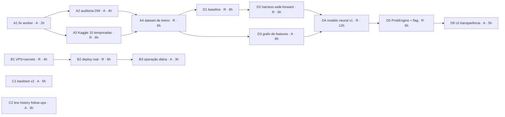

# NBA Scout — Plano de Implementação das Próximas Etapas

> **Para:** André (e Rodrigo)
> **Data:** 2026-07-23 · **Autor:** Rodrigo (com Claude Code)
> **Tracker da dupla:** quadro **NBA Analyzer** no Cadence (perfil pessoal). Este doc é a fonte
> versionada e autossuficiente — **o prompt de cada tarefa está inline** (blocos "Prompt (colar
> no Claude Code)" nas seções 4 e 5), então não depende de nenhum app externo para trabalhar.

---

## 1. Onde o projeto está hoje

O NBA Scout identifica apostas EV+ em player props da NBA cruzando stats reais (ESPN, nba_api)
com odds ao vivo (The Odds API). A transformação de arquitetura (Passos 1–8 do
`docs/PLANO_ARQUITETURA_PROFISSIONAL.md`) está **completa**:

| Área | Estado |
|---|---|
| Backend FastAPI async + worker ARQ + Postgres + Redis | ✅ em `backend/` (monólito legado removido) |
| Frontend React 19 + TS + Tailwind v4 (Terminal Pro, redesign completo) | ✅ em `frontend/` |
| Data Warehouse `player_game_logs` | ✅ populado com **1 temporada** (~26,5k linhas, 474 jogadores, via ESPN) |
| Line Movement Graph (#118) | ✅ tabela `line_history` + `GET /api/line-history` + SVG no Accordion |
| Backtesting Panel (#122) | ✅ settlement diário contra o DW + `GET /api/backtest` + página `/backtest` |
| CI/CD (ci, build-push → ghcr.io, deploy.yml, CodeQL, Gitleaks, Trivy) | ✅ deploy.yml é no-op verde até existirem secrets |
| Deploy real (Passo 9) | ❌ **bloqueado em infra** (VPS + domínio + secrets) |

**O que falta** está organizado em **duas fases** (15 tarefas, ~84h):

- **Fase 1 · Dados & Operação (~39h)** — deixar a máquina girando sozinha: fix do worker,
  DW com 10 temporadas, deploy real, operação diária, backtest v2 e follow-ups de line history.
- **Fase 2 · Motor Neural de EV (~45h)** — substituir a matemática de EV (heurística linear do
  `ev.py`) por um motor aprendido caso a caso: baseline calibrado → harness de avaliação →
  grafo de features → GNN → serving atrás de feature flag. **O `ev.py` nunca é modificado** —
  ele é o baseline de referência e o fallback permanente.

### Regras do jogo (valem para TODAS as tarefas)

1. Branch a partir de `develop`, PR de volta para `develop` (1 tarefa = 1 branch = 1 PR, com issue).
2. CI verde obrigatório: `pytest` + `ruff` + `mypy` (backend) e `vitest` + `tsc` + `eslint` + `prettier` + `build` (frontend).
3. **Nunca** rodar testes de integração contra o DB `nba_scout` — usar `nba_test`
   (o conftest faz `create_all`/`drop_all`; contra o DB real ele **apaga o DW**).
4. Contratos de API são **aditivos**: nunca remover/renomear campo existente do payload.
5. `backend/app/analytics/ev.py` é intocável (33 testes de regressão o protegem).
6. UI segue o design system Terminal Pro: tokens Tailwind v4, zero inline style, dark + light.

---

## 2. Divisão de trabalho e horas

Estimativas assumem dev **com Claude Code assistindo** (some ~30% se for na mão).
No tracker, cada tarefa tem o prompt pronto na aba **Prompt**.

### Rodrigo (R) — ~54h

| ID | Tarefa | Fase | Prio | Horas |
|---|---|---|---|---|
| A3 | Backfill histórico Kaggle (10 temporadas no DW) | 1 | P1 | 6h |
| A4 | Dataset de treino (features + labels do DW) | 1 | P1 | 6h |
| B1 | Infra: VPS + domínio + secrets | 1 | P0 | 4h |
| B2 | Deploy staging → produção + backups + observabilidade | 1 | P1 | 6h |
| D1 | Baseline calibrado (regressão por mercado) | 2 | P1 | 8h |
| D2 | Harness de avaliação walk-forward + ROI | 2 | P1 | 6h |
| D4 | Modelo neural v1 (GNN + MLP) | 2 | P2 | 12h |
| D5 | Serving plugável (ProbEngine + feature flag) | 2 | P2 | 6h |

### André (A) — ~30h

| ID | Tarefa | Fase | Prio | Horas |
|---|---|---|---|---|
| A1 | Fix: worker em crash-loop no backfill (SQL echo + timeout ARQ) | 1 | P0 | 2h |
| A2 | DW em regime: cron `sync_warehouse` + script de auditoria | 1 | P1 | 4h |
| B3 | Operação diária real: crons + monitoramento de uptime | 1 | P2 | 3h |
| C1 | Backtest v2: filtros, stake Kelly e breakdown por mercado | 1 | P2 | 5h |
| C2 | Line history: gráfico nos cards + prune de retenção | 1 | P3 | 3h |
| D3 | Grafo de features do DW (player↔team↔game) | 2 | P2 | 8h |
| D6 | UI: transparência do motor (badge + comparativo) | 2 | P3 | 5h |

> **Sugestão de onboarding do André:** começar por **A1** (pequena, fechada, ensina
> config → session → worker) e emendar **A2** (conhece o DW por dentro). C1/C2 podem
> ser feitas em paralelo a qualquer momento — não dependem de nada.

---

## 3. Mapa de dependências

Seta = "precisa estar pronto antes". Cadeias: **A** = Data Warehouse · **B** = Deploy ·
**C** = Produto (independentes) · **D** = Motor Neural.



Caminhos críticos:
- **Modelo:** A1 → A3 → A4 → D1 → D2 → D4 → D5 → D6 (≈48h encadeadas — por isso A1/A3 vêm primeiro).
- **Produção:** B1 → B2 → B3 (só destrava com a compra da VPS — única dependência externa).
- **Paralelizável desde já:** C1, C2 (André) e B1 (Rodrigo) não dependem de nada.

---

## 4. Fase 1 · Dados & Operação (~39h)

### A1 — Fix: worker em crash-loop no backfill (SQL echo + timeout ARQ)
**Resp.: André · P0 · ~2h · Depende de: — · Destrava: A2, A3**

**Contexto.** Bug real encontrado ao popular o DW (2026-07-22): `backend/app/db/session.py`
liga `echo=True` sempre que `ENVIRONMENT=development`. Sob o fan-out do backfill (~510 jobs
ARQ), a enxurrada de log de SQL trava o event loop e estoura o `conn_timeout` do
`RedisSettings` → worker entra em **crash-loop** (`redis.exceptions.TimeoutError` em
`run_job`). Os jobs são duráveis (nada se perde), mas o worker não fica de pé em dev.
Workaround atual: rodar com `ENVIRONMENT=production`.

**O que fazer**
1. Setting novo `sql_echo: bool = False` em `core/config.py` (env `SQL_ECHO`); usar em
   `db/session.py` no lugar de `environment == "development"`.
2. Subir `conn_timeout` do `RedisSettings` em `workers/settings.py` (ex.: 30s) e revisar retry.
3. Testes unit: default não liga echo; `SQL_ECHO=true` liga; timeout novo aplicado.
4. Validação E2E: `backfill_all_active 1` no stack WSL com `ENVIRONMENT=development`
   drena a fila sem `TimeoutError`.

**Critérios de aceite.** `ENVIRONMENT=development` não liga mais echo por si só; backfill
local estável; nenhum contrato alterado; CI verde.

**Prompt (colar no Claude Code):**
```text
Você é dev do NBA Scout (monorepo backend/ FastAPI async + frontend/ React TS; fila ARQ com Redis; Postgres async). Branch a partir de develop: fix/worker-sql-echo-timeout. PR → develop.

# Tarefa A1 — Fix: worker em crash-loop no backfill (SQL echo + timeout ARQ)
Bug conhecido: backend/app/db/session.py liga echo=cfg.environment=="development". Durante backfill_all_active (~510 jobs ARQ), o volume de log de SQL trava o event loop e estoura o conn_timeout do RedisSettings → worker em crash-loop (redis.exceptions.TimeoutError em run_job/pipe.execute). Jobs são duráveis, mas o worker não fica de pé em dev.

## O que fazer
1. Em backend/app/core/config.py: novo setting sql_echo: bool = False (lido de SQL_ECHO).
2. Em backend/app/db/session.py: echo=cfg.sql_echo (não mais amarrado a environment).
3. Em backend/app/workers/settings.py: RedisSettings com conn_timeout maior (ex. 30) e conferir parâmetros de retry disponíveis na versão do ARQ em uso.
4. Atualizar .env.example com SQL_ECHO comentado.
5. Testes unit: config default (echo off), override por env, e RedisSettings com timeout novo.

## Critérios de aceite
- ENVIRONMENT=development NÃO liga mais echo de SQL por si só.
- Backfill local (docker compose no WSL, comando arq enqueue backfill_all_active 1) drena a fila sem TimeoutError.
- Nenhuma mudança de contrato de API; ev.py intocado.
- pytest, ruff e mypy verdes.

Convenções: commits pequenos, mensagem em pt-BR estilo "fix(worker): ...", PR com descrição do bug + como validou.
```

---

### A2 — DW em regime: validar cron `sync_warehouse` + script de auditoria
**Resp.: André · P1 · ~4h · Depende de: A1 · Destrava: A4**

**Contexto.** O DW foi populado (474 jogadores, ~26,5k linhas) e o cron `sync_warehouse`
já está registrado em `workers/settings.py`. Falta comprovar o regime (sync atualiza
`sync_states`, janela de 100 jogos com prune) e criar o "termômetro" de qualidade dos dados
que será usado após o backfill Kaggle (A3) e antes do dataset de treino (A4).

**O que fazer**
1. Rodar o worker local, forçar/aguardar o `sync_warehouse`; conferir logs + `SyncState`.
2. Verificar prune: nenhum jogador com >100 jogos após o sync.
3. Criar `scripts/dw_audit.py`: total de linhas; cobertura por jogador/temporada; jogadores
   com <10 jogos; buracos de datas; duplicatas por `(player_id, game_date)`; % `is_playoff`;
   nulos por coluna relevante (`min`, `pts`, `reb`, `ast`).
4. RUNBOOK: seção "Saúde do Data Warehouse" (como rodar, valores esperados).

**Critérios de aceite.** Auditoria roda contra o DW local com relatório legível, sem
duplicatas nem violação de janela; RUNBOOK atualizado; CI verde.

**Prompt (colar no Claude Code):**
```text
Você é dev do NBA Scout (backend/ FastAPI async, worker ARQ, Postgres com DW de gamelogs em player_game_logs). Branch: feat/dw-audit. PR → develop.

# Tarefa A2 — DW em regime: validar cron sync_warehouse + script de auditoria
Contexto: DW populado com ~26,5k linhas (1 temporada, ESPN). Cron sync_warehouse já registrado em app/workers/settings.py (hour=cron_warehouse_sync_hour). Janela de produção: 100 jogos/jogador com prune no sync (services/warehouse.py / services/ingest.py).

## O que fazer
1. Suba o stack local (docker compose) e valide o sync_warehouse de ponta a ponta (pode enfileirar manualmente via CLI arq/enqueue). Confirme: logs sem erro, SyncState atualizado, prune da janela de 100 jogos funcionando.
2. Crie scripts/dw_audit.py (rodável com python -m ou via docker exec) que imprime: total de linhas; nº de jogadores com dados; linhas por temporada; jogadores com menos de 10 jogos; buracos de datas suspeitos; violações de janela (>100 jogos); duplicatas por (player_id, game_date); % de is_playoff; nulos por coluna relevante (min, pts, reb, ast).
3. Adicione seção "Saúde do Data Warehouse" no docs/RUNBOOK.md: como rodar a auditoria, valores esperados, o que fazer se algo estiver fora.

## Critérios de aceite
- Script roda sem dependências novas pesadas (SQLAlchemy já disponível; saída em texto simples).
- NUNCA rodar testes de integração contra o DB nba_scout (usar nba_test) — o conftest dropa tabelas.
- pytest/ruff/mypy verdes; RUNBOOK atualizado.
```

---

### A3 — Backfill histórico: Kaggle 10 temporadas no DW (~350k linhas)
**Resp.: Rodrigo · P1 · ~6h · Depende de: A1 · Destrava: A4**

**Contexto.** O DW só tem a última temporada. O adapter `ingest_kaggle()` existe desde o
Passo 5 (schema `nathanlauga/nba-games`: `games_details.csv` + `games.csv`, filtro
`only_active`), mas nunca rodou por falta do CSV. Meta: ~10 temporadas de jogadores ativos
(~350k linhas) — dataset mínimo da Fase 2. Merge com a ESPN via `ON CONFLICT
uq_player_gamedate` + `COALESCE` (dado mais rico vence).

**O que fazer**
1. Baixar o dataset Kaggle e disponibilizar ao container.
2. Garantir entrada executável (task ARQ ou CLI) para `ingest_kaggle`; rodar a carga
   completa no stack WSL (pós-A1, echo off); medir tempo/linhas.
3. Validar merge ESPN×Kaggle em 3 jogadores (COALESCE não sobrescreve com nulos).
4. Rodar `scripts/dw_audit.py` (A2) antes/depois e colar no PR.
5. RUNBOOK: procedimento repetível do backfill histórico.

**⚠ Risco conhecido.** O prune de janela de 100 jogos do sync pode **apagar o histórico
bulk**. Investigar `services/warehouse.py` ANTES de rodar e propor solução no PR
(prune configurável/desligado no histórico, ou tabela de treino separada).

**Critérios de aceite.** ≥8 temporadas para veteranos; zero duplicatas; `/player`
continua DW-first; CI verde.

**Prompt (colar no Claude Code):**
```text
Você é dev do NBA Scout. Branch: feat/dw-backfill-kaggle. PR → develop (mudanças de código, se houver; a carga em si é operação local).

# Tarefa A3 — Backfill histórico: Kaggle 10 temporadas no DW
Contexto: services/ingest.py já tem parse_kaggle_details + ingest_kaggle (schema nathanlauga/nba-games), com upsert ON CONFLICT uq_player_gamedate + COALESCE e materialização de combos (PRA/PR/PA/RA/STOCKS). only_active filtra pela tabela Player. O DW tem hoje ~26,5k linhas (ESPN, última temporada).

## O que fazer
1. Verifique se ingest_kaggle tem entrada executável (task ARQ ou CLI). Se não houver, crie um comando simples (ex.: python -m app.services.ingest_kaggle --details ... --games ... --only-active) que roda dentro do container.
2. Rode a carga completa no stack WSL. Meça tempo e linhas inseridas/atualizadas; logue um resumo ao final.
3. Valide o merge com a ESPN: escolha 3 jogadores com dados das duas fontes e confira que campos não-nulos não foram sobrescritos por nulos (COALESCE).
4. Rode scripts/dw_audit.py e cole o antes/depois na descrição do PR.
5. Atualize docs/RUNBOOK.md com o passo a passo do backfill histórico.

## Critérios de aceite
- ~10 temporadas de jogadores ativos no DW; zero duplicatas; janela de 100 jogos NÃO se aplica ao histórico bulk (conferir se o prune do sync não apaga histórico — se apagar, propor ajuste: prune só na janela do sync incremental, preservando histórico para treino).
- ATENÇÃO: risco real de o prune de 100 jogos conflitar com a meta de histórico profundo. Investigue services/warehouse.py antes de rodar e proponha a solução no PR (ex.: prune configurável/desligado, ou tabela de treino separada).
- pytest/ruff/mypy verdes.
```

---

### A4 — Dataset de treino: features + labels a partir do DW
**Resp.: Rodrigo · P1 · ~6h · Depende de: A2, A3 · Destrava: D1, D3**

**Contexto.** Ponte para a Fase 2. Transforma `player_game_logs` em dataset supervisionado
por prop: para cada (jogador, jogo, mercado, linha), as features que o `ev.py` usa hoje
(médias móveis, freq sobre a linha, playoffs, defensive rating do adversário, pace, minutos,
descanso/back-to-back) calculadas **somente com jogos anteriores à data-alvo**, e label =
stat real ≥ linha. Sem odds históricas profundas, a linha sintética vem da média móvel
(arredondada a .5, coluna `line_source`); linhas reais recentes vêm de
`analyzed_props`/`line_history`.

**O que fazer**
1. `backend/app/analytics/dataset.py` com `build_training_rows()` (pura, testável).
2. Reusar `stats_parsing`/`matchup` para features idênticas às do `ev.py`, com **corte
   temporal estrito** (teste unit prova que nenhuma feature usa o jogo-alvo ou futuro).
3. Linha sintética + flag `line_source`.
4. CLI `python -m app.analytics.dataset --out data/train.parquet --valid-from <data>`
   (split temporal; pyarrow no pyproject se faltar).
5. Testes de não-vazamento, labels e NaN.

**Critérios de aceite.** Offline-only (`ev.py` e `/api/props` intocados); reprodutível;
>100k linhas pós-A3; CI verde.

**Prompt (colar no Claude Code):**
```text
Você é dev do NBA Scout. Branch: feat/training-dataset. PR → develop.

# Tarefa A4 — Dataset de treino: features + labels a partir do DW
Contexto: DW com ~10 temporadas (pós A3). O motor heurístico atual (backend/app/analytics/ev.py — NÃO MODIFICAR) usa: frequência histórica sobre a linha, blend playoffs 0.65/0.35, ajuste por defensive rating do adversário, pace e cascata de minutos, clamp 25–85%. Queremos um dataset supervisionado equivalente para treinar modelos (Fase 2).

## O que fazer
1. backend/app/analytics/dataset.py: build_training_rows(session, markets, seasons, ...) → linhas com: ids (player, game, market), data, features (avg últimos 5/10/20, freq sobre a linha, home/away, dias de descanso, back-to-back, is_playoff, opp_def_rating, pace, minutos médios), line (real quando existir em analyzed_props/line_history; senão sintética = média móvel arredondada a .5, com coluna line_source), label = stat_real >= line.
2. CORTE TEMPORAL ESTRITO: para o jogo em data D, toda feature usa apenas jogos com data < D. Escreva teste unit que prova isso.
3. CLI: python -m app.analytics.dataset --out data/train.parquet --valid-from 2026-01-01 (split temporal). Parquet via pandas/pyarrow (adicionar pyarrow ao pyproject se faltar).
4. Testes: não-vazamento, labels corretos num cenário sintético pequeno, ausência de NaN nas colunas obrigatórias.

## Critérios de aceite
- ev.py e o contrato /api/props intocados; módulo novo é offline-only.
- Reprodutível (mesma seed/params → mesmo dataset).
- pytest/ruff/mypy verdes.
```

---

### B1 — Infra: provisionar VPS, domínio e secrets
**Resp.: Rodrigo · P0 · ~4h · Depende de: — (bloqueio externo: compra) · Destrava: B2**

**Contexto.** Único bloqueio externo do plano. Pipeline pronto: `deploy.yml` roda como
no-op verde sem o secret `SSH_HOST`. Decisão já tomada (ADR 0002): VPS único + Docker
Compose via SSH (controle de rede p/ geoblock ESPN/nba_api). Tarefa 100% operacional.

**O que fazer**
1. VPS Ubuntu 24.04 (≥2 GB RAM) + apontar domínio/subdomínio.
2. Hardening: usuário `deploy` com chave SSH dedicada, `ufw` (22/80/443), `fail2ban`,
   `unattended-upgrades`, docker + compose plugin.
3. GitHub Environments `staging` e `production` com secrets: `SSH_HOST`, `SSH_USER`,
   `SSH_KEY`, `ODDS_API_KEY`, `POSTGRES_PASSWORD`, `SENTRY_DSN`; required reviewers em
   `production`.
4. `deploy.yml` via `workflow_dispatch` com `dry_run=true` → verde.

**Critérios de aceite.** Dry-run verde com secrets reais; SSH só por chave; portas fechadas.

**Prompt (guia de operação — sem código):**
```text
Tarefa de infra (sem código). Guia: docs/DEPLOY.md, docs/adr/0002-deploy-platform.md e .github/workflows/deploy.yml do repo NBA Scout.

# Tarefa B1 — Provisionar VPS + domínio + secrets
1. VPS Ubuntu 24.04 (≥2 GB RAM). Criar usuário deploy com chave SSH dedicada (sem senha), ufw allow 22/80/443, fail2ban, unattended-upgrades, instalar docker + compose plugin.
2. Apontar DNS do domínio/subdomínio para o IP.
3. GitHub → Settings → Environments: criar staging e production. Secrets em ambos: SSH_HOST, SSH_USER, SSH_KEY (privada do deploy), ODDS_API_KEY, POSTGRES_PASSWORD, SENTRY_DSN. Em production: required reviewers = Rodrigo.
4. Actions → deploy.yml → workflow_dispatch com dry_run=true em staging: deve conectar e ensaiar sem aplicar.
Checklist de saída: dry_run verde; ssh só por chave; ufw ativo; docker hello-world OK.
```

---

### B2 — Deploy real: staging → produção, backups e observabilidade
**Resp.: Rodrigo · P1 · ~6h · Depende de: B1 · Destrava: B3**

**O que fazer**
1. Merge `develop` → `main` → staging automático (pull ghcr.io, `alembic upgrade head`,
   healthchecks).
2. Smoke test do RUNBOOK: `/health/ready`, `/api/props`, `/api/backtest`, frontend, worker.
3. Tag `v1.0.0` → production (aprovar como reviewer).
4. Crontab do host: `scripts/backup-postgres.sh` diário 04:00 + **teste de restore**.
5. `compose.observability.yml` (Grafana :3001, trocar senha admin) + `SENTRY_DSN`.
6. Ensaiar rollback (workflow_dispatch com `image_tag` anterior).

**Critérios de aceite.** Staging + produção respondendo por domínio; backup restaurável;
métricas no Grafana; rollback ensaiado.

**Prompt (colar no Claude Code):**
```text
Você é dev/ops do NBA Scout. Sem branch de código (a menos que encontre bug); operação guiada por docs/DEPLOY.md + docs/RUNBOOK.md.

# Tarefa B2 — Deploy staging → produção + backups + observabilidade
Pré-requisito: B1 (VPS + secrets) pronto.
1. Faça merge develop → main (PR). Acompanhe build-push.yml (imagens ghcr.io) e deploy.yml → staging: pull, alembic upgrade head, docker compose up, healthcheck.
2. Rode o smoke test do RUNBOOK: /health/ready 200; GET /api/props responde (demo mode é aceitável sem jogos); GET /api/backtest 200; frontend carrega; worker logando cron.
3. Tag v1.0.0 no main → production (environment com required reviewer).
4. Backups: agende scripts/backup-postgres.sh no crontab do host (04:00) e TESTE um restore em DB descartável.
5. Observabilidade: docker compose -f docker/compose.yml -f docker/compose.prod.yml -f docker/compose.observability.yml up -d; Grafana em :3001 (mudar senha admin); configurar SENTRY_DSN no .env de produção.
6. Ensaie rollback: workflow_dispatch do deploy.yml com image_tag anterior (dry_run primeiro).
Saída: checklist preenchido na issue + prints do Grafana/healthchecks.
```

---

### B3 — Operação diária real: crons + monitoramento de uptime
**Resp.: André · P2 · ~3h · Depende de: B2**

**Contexto.** Com produção no ar, a máquina precisa girar sozinha: `run_daily_analysis`
(análise EV do dia), `settle_results` (liquidação de props/apostas contra o DW, 14:30 UTC,
void após 3 dias) e `sync_warehouse`. **A partir daqui o `/backtest` acumula dados reais** —
insumo da Fase 2. Vigiar a quota da Odds API (500 req/mês).

**O que fazer**
1. Conferir os 3 crons em produção por 3 dias (horários UTC, execuções logadas) e
   documentar como consultar.
2. Registrar consumo real de quota por análise no RUNBOOK (`/api/status`).
3. Monitor externo gratuito (healthchecks.io / UptimeRobot) no `/health/ready`.
4. RUNBOOK: "Checklist semanal de operação".

**Critérios de aceite.** 3 dias corridos com snapshot diário + settlement + sync sem
intervenção; alerta dispara em derrubada proposital.

**Prompt (colar no Claude Code):**
```text
Você é dev do NBA Scout cuidando de operação. Sem mudanças de código esperadas (só RUNBOOK); crie branch docs/ops-checklist se precisar commitar.

# Tarefa B3 — Operação diária real + monitoramento
Contexto: produção no ar (B2). Crons no worker (app/workers/settings.py): sync_warehouse (cron_warehouse_sync_hour), settle_results (cron_settlement_hour:30 — liquida props e apostas contra o DW, void após 3 dias), run_daily_analysis (cron_analysis_hour).
1. Verifique nos logs de produção que os 3 crons executaram nos horários esperados (UTC!) por 3 dias seguidos. Documente como consultar (docker compose logs worker | grep ...).
2. Cheque a quota da Odds API no GET /api/status após a análise diária; com 500 req/mês, 1 análise/dia deve manter folga — registre o consumo real por análise no RUNBOOK.
3. Configure healthchecks.io (ou UptimeRobot) apontando para https://<dominio>/health/ready, alerta por e-mail.
4. RUNBOOK: seção "Checklist semanal de operação" (quota, último backup, disco, settlement de ontem OK, snapshot de hoje existe).
Saída: evidências (logs/prints) na issue + PR do RUNBOOK.
```

---

### C1 — Backtest v2: filtros, stake Kelly e breakdown por mercado
**Resp.: André · P2 · ~5h · Depende de: — (paralelizável)**

**Contexto.** O painel (#122) entrou com o mínimo (stake flat 1u, agregado geral). A v2 o
torna analítico: filtros por período/mercado/rating, stake Kelly (o `kelly_pct` já fica
gravado em cada prop liquidada), breakdown por mercado/rating e export CSV. Essa base de
filtros será reutilizada no comparativo de motores (D6).

**O que fazer**
1. Backend: query params opcionais `from`, `to`, `market`, `rating`, `stake_mode`
   (`flat|kelly`) em `GET /api/backtest` (validação Pydantic, 422 para inválidos).
2. `stake_mode=kelly`: stake = `kelly_pct/100 ×` bankroll unitário (cap 5u; documentar).
3. Response **aditivo**: `by_market` e `by_rating` (`{key, n, pnl, hit_rate, roi}`).
4. Frontend `/backtest`: FilterBar (presets 7/30/90 dias + custom, pills de mercado/rating),
   toggle Flat/Kelly, tabelas de breakdown, export CSV (`lib/csv.ts`).
5. Testes de integração com seed (DB `nba_test`!) + Vitest de helpers puros.

**Critérios de aceite.** Contrato aditivo; design system respeitado; CI todo verde.

**Prompt (colar no Claude Code):**
```text
Você é dev do NBA Scout (backend FastAPI + frontend React TS com TanStack Query; página /backtest já existe). Branch: feat/backtest-v2. PR → develop.

# Tarefa C1 — Backtest v2: filtros, stake Kelly e breakdown
Contexto: GET /api/backtest hoje agrega tudo com stake flat 1u (routers/backtest.py, schemas/backtest.py, services/settlement.py liquida props diariamente). Cada AnalyzedProp liquidada tem market, rating e kelly_pct persistidos.

## O que fazer
1. Backend: query params opcionais from (date), to (date), market (str), rating (str), stake_mode (flat|kelly, default flat). Validar com Pydantic; 422 para valores inválidos.
2. stake_mode=kelly: stake da prop = kelly_pct/100 * bankroll_unitário (documente a convenção; use fração já gravada, cap em 5u para outliers).
3. Response: manter campos atuais e ADICIONAR by_market e by_rating (lista de {key, n, pnl, hit_rate, roi}). Contrato aditivo — não remover nada.
4. Frontend (/backtest): FilterBar com período (presets 7/30/90 dias + custom), mercado e rating (pills), toggle Flat/Kelly; tabelas de breakdown; botão exportar. NOTA: lib/csv.ts foi removido no #120 — reutilize lib/xls.ts (export .xls em colunas) ou reintroduza CSV, decida no PR.
5. Testes: integração backend com seed de props liquidadas (usar DB nba_test!); Vitest para lógica de UI extraída em helpers puros.

## Critérios de aceite
- Contrato existente do /api/backtest preservado (aditivo).
- UI segue o design system (tokens Tailwind v4, componentes existentes; nada de inline style).
- pytest + vitest + tsc + eslint + prettier verdes.
```

---

### C2 — Line history: gráfico nos cards + prune de retenção
**Resp.: André · P3 · ~3h · Depende de: — (paralelizável)**

**Contexto.** Follow-ups do #118: o `LineMovementGraph` (SVG) só aparece no AccordionPanel
da tabela — falta no `PlayerPropCard` e nos cards. E `line_history` é append-only: sem prune
cresce para sempre.

**O que fazer**
1. Renderizar `LineMovementGraph` no `PlayerPropCard` e na variação `PropsCards`
   (não renderizar com <2 pontos).
2. Setting `line_history_retention_days: int = 30` em `config.py`.
3. Prune no cron diário (`DELETE` do que passou da retenção) — task própria ou passo do
   `run_daily_analysis`, o mais simples (justificar no PR).
4. Testes: prune respeita o limite; componente com 0/1/N pontos.

**Critérios de aceite.** Sem mudança de contrato; CI verde.

**Prompt (colar no Claude Code):**
```text
Você é dev do NBA Scout. Branch: feat/line-history-followups. PR → develop.

# Tarefa C2 — Line history nos cards + prune de retenção
Contexto: #118 criou a tabela append-only line_history (1 ponto/prop/análise), GET /api/line-history e o componente LineMovementGraph (SVG) usado no AccordionPanel da tabela do Dashboard.

## O que fazer
1. Frontend: usar LineMovementGraph também em PlayerPropCard (página Player) e na variação PropsCards do Dashboard. Buscar via query existente do line-history; se <2 pontos, não renderizar (sem placeholder feio).
2. Backend: setting line_history_retention_days: int = 30 em core/config.py; no cron diário, DELETE FROM line_history WHERE created_at < now() - retenção (task pequena registrada no worker ou passo dentro de run_daily_analysis — escolha o mais simples e justifique no PR).
3. Testes: unit/integração do prune (DB nba_test); Vitest dos estados do componente (0, 1, N pontos).

## Critérios de aceite
- Nenhuma mudança de contrato nos endpoints existentes.
- Design system respeitado (tokens; SVG já existente reutilizado).
- pytest + vitest + tsc verdes.
```

---

## 5. Fase 2 · Motor Neural de EV (~45h)

> **Filosofia da fase.** O `ev.py` atual soma ajustes fixos (freq histórica + blend de
> playoffs 0.65/0.35 + defesa/pace/minutos + clamp 25–85%). A hipótese é que um modelo
> aprendido capture interações que regras manuais não capturam (matchup específico,
> cadeias de lesão, contexto situacional). **Mas hipótese se testa:** baseline honesto
> primeiro, harness imparcial depois, e o neural só entra se **vencer no gate objetivo**
> (Brier **e** ROI no walk-forward). Em produção, tudo atrás de feature flag com fallback
> automático para a heurística.

### D1 — Baseline calibrado: regressão por mercado
**Resp.: Rodrigo · P1 · ~8h · Depende de: A4 · Destrava: D2**

1. `analytics/models/baseline.py`: LogisticRegression (ou GB simples, justificar) **por
   mercado**, pipeline sklearn, `predict_proba` → prob de bater a linha; persistência joblib.
2. Split temporal (nunca aleatório) + calibração (isotônica/Platt) no valid.
3. Comparação justa com a heurística nas MESMAS props: Brier, log-loss, calibração
   (10 bins) por mercado e agregado.
4. CLI `train|eval`; mini-relatório markdown no PR.
5. Testes unit (dataset sintético: convergência, persistência roundtrip, métricas).

**Aceite:** reprodutível (seed); Brier ≤ heurística no valid (senão, documentar hipóteses);
offline-only; sklearn/joblib num extra `[ml]` do pyproject.

**Prompt (colar no Claude Code):**
```text
Você é dev/ML do NBA Scout. Branch: feat/ev-baseline-model. PR → develop. sklearn/joblib podem entrar como dependência de um extra opcional (ex.: [ml]) no pyproject do backend.

# Tarefa D1 — Baseline calibrado (regressão por mercado)
Contexto: dataset supervisionado de A4 (data/train.parquet: features do estilo ev.py + line + label). Motor heurístico atual: backend/app/analytics/ev.py — NÃO MODIFICAR (é o baseline de referência e tem 33 testes).

## O que fazer
1. backend/app/analytics/models/baseline.py: LogisticRegression (ou GradientBoosting simples — justifique) POR MERCADO, pipeline com imputação/normalização; predict_proba → prob de bater a linha; salvar/carregar via joblib em models/artifacts/.
2. Split temporal (nunca aleatório). Calibrar no valid (CalibratedClassifierCV isotonic ou sigmoid).
3. Comparação justa com a heurística: para cada prop do valid, prob heurística (reproduzida a partir das mesmas features/funções do ev.py) × prob do baseline; reportar Brier, log-loss e curva de calibração (10 bins) por mercado e agregado.
4. CLI train|eval com --data e --artifacts; saída de eval em JSON + tabela markdown.
5. Testes unit com dataset sintético pequeno (fit converge, persistência roundtrip, métricas calculadas).

## Critérios de aceite
- Offline-only: nada no request-path; ev.py e contrato /api/props intocados.
- Reprodutível com seed fixa. pytest/ruff/mypy verdes (mypy pode precisar de ignores pontuais p/ sklearn).
```

### D2 — Harness de avaliação: walk-forward + ROI simulado
**Resp.: Rodrigo · P1 · ~6h · Depende de: D1 · Destrava: D4**

1. `analytics/eval.py`: `walk_forward(dataset, engines, window='M')` — treina cada engine
   treinável até M, avalia em M+1, desliza. Engines = interface comum
   (`fit` opcional + `predict_proba(rows)`).
2. Métricas por janela e agregadas: Brier, log-loss, calibração e **ROI simulado** das props
   STRONG de cada engine (stake flat e kelly/4 cap 5u; odd sintética -110 quando não houver
   odd real — documentar).
3. Saída `eval_report.json` + `eval_report.md`; CLI com `--engines heuristic,baseline`.
4. Testes unit com dataset sintético (janelas corretas, sem vazamento).

**Aceite:** determinístico com seed; harness completo <10min no dataset real; CI roda só a
fixture sintética.

**Prompt (colar no Claude Code):**
```text
Você é dev/ML do NBA Scout. Branch: feat/eval-harness. PR → develop.

# Tarefa D2 — Harness de avaliação walk-forward + ROI
Contexto: baseline (D1) e heurística (ev.py) prontos; dataset A4. Precisamos do juiz imparcial da Fase 2.

## O que fazer
1. backend/app/analytics/eval.py: walk_forward(dataset, engines, window='M') — treina cada engine treinável até M, avalia todos em M+1, desliza pelo período; engines são callables/objetos com interface comum (fit opcional + predict_proba(rows)).
2. Métricas por janela e agregadas: Brier, log-loss, calibração (10 bins), e ROI simulado: para cada engine, apostar 1u (flat) e kelly/4 (cap 5u) nas props que o engine classificaria STRONG (recriar o corte de rating a partir do EV calculado com a prob do engine e a odd implícita da linha — documente a convenção de odd sintética -110 quando não houver odd real).
3. Saída: eval_report.json + eval_report.md (tabelas por mercado e agregado).
4. CLI: python -m app.analytics.eval --data data/train.parquet --engines heuristic,baseline.
5. Testes unit com dataset sintético: janelas walk-forward corretas, sem vazamento, ROI calculado como esperado num caso de mão.

## Critérios de aceite
- Nenhum estado global; reprodutível; roda no CI com dataset sintético pequeno (teste), dataset real só local.
- pytest/ruff/mypy verdes.
```

### D3 — Grafo de features do DW (player ↔ team ↔ game)
**Resp.: André · P2 · ~8h · Depende de: A4 · Destrava: D4**

1. `analytics/graph.py` com `build_graph(session, until_date)` → `HeteroData`
   (PyTorch Geometric):
   nós `player`/`team`/`game`; arestas `(player, played_in, game)` com stats do jogo como
   **atributo de aresta**, `(game, against, team)`, `(player, teammate_of, player)`,
   `(game, back_to_back, game)`.
2. Z-score por temporada nos contínuos (guardar médias/desvios para inferência).
3. `until_date` **estrito** (nada de jogos ≥ D) — teste explícito.
4. Export `data/graphs/graph_until_<date>.pt` + `GRAPH_SCHEMA.md`.
5. Testes contra fixture SQL pequena: contagens batem com SQL direto; shapes.

**Aceite:** torch/PyG isolados no extra `[ml]` (lazy import — não pesa worker nem imagem de
produção); 1 temporada gera em <2min; CI verde.

**Prompt (colar no Claude Code):**
```text
Você é dev do NBA Scout. Branch: feat/feature-graph. PR → develop. Dependência torch/torch-geometric entra no extra [ml] do pyproject (offline-only, não vai para a imagem de produção — confira o Dockerfile).

# Tarefa D3 — Grafo de features do DW
Contexto: DW player_game_logs (~10 temporadas pós A3) + tabelas Player/Team/Game. Objetivo: grafo heterogêneo para GNN (D4).

## O que fazer
1. backend/app/analytics/graph.py com build_graph(session, until_date) → HeteroData:
   - Nós player (atributos: médias móveis até a data, idade se disponível, posição se disponível), team (ritmo/def rating médios até a data), game (data, home/away, is_playoff).
   - Arestas: (player, played_in, game) com stats do jogo COMO ATRIBUTO DE ARESTA (pts, reb, ast, min); (game, against, team) 2×; (player, teammate_of, player) por coocorrência no mesmo time/jogo; (game, back_to_back, game) quando dias consecutivos do mesmo time.
2. Normalização: z-score por temporada para atributos contínuos; guardar médias/desvios usados (para aplicar em inferência).
3. until_date estrito: nenhum nó/aresta de jogos com data >= until_date.
4. Export: save em data/graphs/graph_until_<date>.pt + GRAPH_SCHEMA.md descrevendo tipos e shapes.
5. Testes unit contra fixture SQL pequena (DB nba_test): contagens, corte temporal, shapes dos tensores.

## Critérios de aceite
- Não toca request-path nem ev.py; imports de torch ficam isolados (lazy) para não pesar o worker.
- pytest/ruff/mypy verdes; geração de 1 temporada <2 min local.
```

### D4 — Modelo neural v1: encoder GNN + cabeça MLP
**Resp.: Rodrigo · P2 · ~12h · Depende de: D2, D3 · Destrava: D5**

1. `analytics/models/neural.py`: encoder heterogêneo (GraphSAGE/GAT, 2 camadas) → embedding
   do jogador no contexto; head MLP recebe `[embedding ‖ features A4 ‖ line]` → sigmoid.
2. Treino: NeighborLoader (ou full-batch por temporada), AdamW, early stopping (paciência 5)
   no valid temporal, seed fixa, curvas em CSV.
3. Calibração isotônica pós-treino.
4. **Rodar o harness D2** com heurística × baseline × neural; anexar `eval_report.md` ao PR.
5. Persistir `artifacts/neural_v1/` (state_dict + config + normalizadores) + `MODEL_CARD.md`.

**Gate objetivo (inegociável):** o neural só integra se **superar o baseline D1 em Brier E
em ROI** no walk-forward. Se não superar, o PR vira relatório com hipóteses — também é
entrega válida, e o produto segue com o melhor motor disponível.

**Prompt (colar no Claude Code):**
```text
Você é dev/ML do NBA Scout. Branch: feat/neural-ev-v1. PR → develop (extra [ml]).

# Tarefa D4 — Modelo neural v1 (GNN + MLP)
Contexto: grafo D3 (HeteroData), dataset A4, harness D2 como juiz, baseline D1 como piso.

## O que fazer
1. backend/app/analytics/models/neural.py: encoder heterogêneo (GraphSAGE ou GAT via torch_geometric.nn.HeteroConv, 2 camadas) → embedding do player no contexto até a data; head MLP recebe [embedding ‖ features tabulares A4 ‖ line] → sigmoid.
2. Treino: mini-batch por vizinhança (NeighborLoader) ou full-batch por temporada se couber; AdamW, early stopping (paciência 5) no log-loss do valid temporal; seed fixa; salvar curvas (CSV simples).
3. Calibração isotônica pós-treino no valid.
4. Avaliar no harness D2 com os 3 engines e anexar eval_report.md ao PR.
5. Persistência: artifacts/neural_v1/ (state_dict, config JSON, normalizadores); MODEL_CARD.md curto (dados, features, métricas, limitações).

## Critérios de aceite (gate objetivo)
- Neural SUPERA baseline D1 em Brier E em ROI simulado no walk-forward. Se não superar: PR vira relatório (não integra o modelo) com hipóteses e próximos passos — isso também é entrega válida.
- Reprodutível; smoke test de treino (1 época, fixture sintética) no CI; pytest/ruff verdes.
```

### D5 — Serving plugável: ProbEngine com feature flag e fallback
**Resp.: Rodrigo · P2 · ~6h · Depende de: D4 · Destrava: D6**

1. `analytics/engine.py`: Protocol `ProbEngine.predict(ctx) → float`; `HeuristicEngine`
   (delegação pura ao `ev.py`, sem copiar código) e `ModelEngine` (artefato lazy; qualquer
   erro → warning + fallback heurístico — **nunca derruba a análise**).
2. `core/config.py`: `ev_engine: 'heuristic'|'model' = 'heuristic'` + `ev_model_path`.
3. `services/analysis.py` obtém prob via engine; **campo aditivo** `prob_source` persistido
   em `analyzed_props` (migração Alembic aditiva) e exposto no payload.
4. Testes: flag off → payload idêntico ao atual (fora `prob_source`); flag on com modelo
   fake → `prob_source='model'`; artefato ausente → fallback; **33 testes do `ev.py`
   intactos**.

**Prompt (colar no Claude Code):**
```text
Você é dev do NBA Scout. Branch: feat/prob-engine-flag. PR → develop.

# Tarefa D5 — ProbEngine plugável com feature flag
Contexto: motor vencedor da Fase 2 (D4 ou, se o gate reprovar, baseline D1) precisa entrar em produção atrás de flag, com a heurística como fallback permanente. ev.py NÃO MUDA.

## O que fazer
1. backend/app/analytics/engine.py: Protocol ProbEngine com predict(ctx) → float. HeuristicEngine embrulha a lógica atual (delegação pura — sem copiar código do ev.py). ModelEngine carrega artefato (joblib/torch) lazy no primeiro uso; qualquer erro → log warning + delega à heurística.
2. core/config.py: ev_engine: Literal['heuristic','model'] = 'heuristic' (+ ev_model_path).
3. services/analysis.py: obter prob via engine injetado; gravar prob_source ('heuristic'|'model') — migração Alembic ADITIVA em analyzed_props + campo no schema PropOut e no _row_to_out (aditivo).
4. Worker: nada muda estruturalmente; engine é resolvido no início da análise.
5. Testes: (a) flag off → payload idêntico ao atual exceto prob_source; (b) flag on com modelo fake determinístico → prob vem do modelo; (c) artefato ausente → fallback silencioso com warning; (d) 33 testes do ev.py intactos.

## Critérios de aceite
- Contrato aditivo; frontend atual continua funcionando sem mudanças.
- pytest/ruff/mypy verdes; migração aditiva reversível.
```

### D6 — UI: transparência do motor (badge + comparativo no backtest)
**Resp.: André · P3 · ~5h · Depende de: D5**

1. `types/api.ts`: `prob_source?: 'heuristic' | 'model'`.
2. Atom `EngineBadge` discreto ('H' neutro / 'N' accent, tooltip por extenso) no `PropCard`,
   `PropsTableTerminal` e `PlayerPropCard`. Props antigas (sem o campo) renderizam como hoje.
3. `/backtest`: segmentação por `prob_source` (reusa filtros do C1) + duas curvas de bankroll
   no mesmo gráfico quando houver dados dos dois motores.
4. Tooltip "principais fatores" se o backend expuser `feature_importances` (opcional,
   degradar sem o campo).
5. Vitest dos estados; CI frontend todo verde.

**Prompt (colar no Claude Code):**
```text
Você é dev frontend do NBA Scout (React 19 + TS + Tailwind v4 tokens + TanStack Query; design Terminal Pro, accent âmbar, verde/vermelho só para sinal). Branch: feat/engine-transparency-ui. PR → develop.

# Tarefa D6 — Transparência do motor na UI
Contexto: payload de /api/props e /api/backtest agora tem prob_source ('heuristic'|'model') — campo opcional (props antigas não têm).

## O que fazer
1. types/api.ts: prob_source?: 'heuristic' | 'model'.
2. Badge pequeno e discreto (componente atom novo EngineBadge): 'H' (heurístico, neutro) / 'N' (neural, accent) com tooltip por extenso. Renderizar em PropCard, PropsTableTerminal (coluna compacta ou junto do rating) e PlayerPropCard.
3. /backtest: usar os filtros do C1; adicionar segmentação por prob_source e, quando houver dados dos DOIS motores no período, renderizar as duas curvas de bankroll no mesmo gráfico (legenda clara).
4. Tooltip 'principais fatores': se o item trouxer feature_importances (campo futuro opcional), listar top 3; sem o campo, não renderizar nada.
5. Vitest: EngineBadge (3 estados), lógica de segmentação (helper puro testável).

## Critérios de aceite
- Zero inline styles; tokens/atoms existentes; dark e light OK.
- Props sem prob_source renderizam como hoje (sem badge).
- vitest + tsc + eslint + prettier + build verdes.
```

---

## 6. Riscos e mitigação

| Risco | Impacto | Mitigação |
|---|---|---|
| Prune da janela de 100 jogos apagar o histórico bulk do Kaggle | Perde o dataset da Fase 2 | Investigar `services/warehouse.py` **antes** da carga (A3); prune configurável ou tabela de treino separada |
| Geoblock ESPN/nba_api na VPS | Análise diária falha em produção | ADR 0002 já prevê: proxy HTTPS_PROXY + demo fallback + DW local |
| Quota Odds API (500 req/mês) | Sem odds ao vivo no fim do mês | 1 análise/dia + monitorar em B3; sistema já se auto-limita com quota <10 |
| Modelo neural não bater o baseline | "Perde" as ~12h do D4 | Gate objetivo do D2: o produto segue com o melhor motor; o relatório orienta a v2 |
| Vazamento temporal no dataset/grafo | Métricas irreais, modelo inútil | Testes de não-vazamento obrigatórios em A4 e D3 (criterio de aceite) |
| DB de teste vs DW real | Apagar o DW por engano | Regra 3: integração SÓ contra `nba_test` |

## 7. Como trabalhar com o tracker

1. Abra o tracker: https://claude.ai/code/artifact/54a1c630-a872-4ea3-9b9a-11c458b941e3
2. Aba **Mapa de dependências** mostra quem destrava quem; clique num nó para abrir a tarefa.
3. Na tarefa: marque subtasks conforme avança, use **✓ feito** ao mergear o PR, **⚠ débito**
   se deixou algo para depois (anote no PR o quê), **✗ desativar** se decidirmos cortar.
4. Aba **Prompt**: botão *Copiar prompt* → colar no Claude Code para começar a tarefa.
5. As marcações ficam no navegador de cada um — use **Copiar resumo** e cole no nosso chat
   para sincronizar o status.
6. **Copiar link** dentro da tarefa gera um link com âncora (`#A3`); quem recebe usa
   "Ir para task · cole o link" para abrir direto.

---

*Gerado a partir do grafo de conhecimento do repo (graphify — `graphify-out/graph.html`,
1549 nós / 2820 arestas, atualizado 2026-07-23), do `docs/PLANO_ARQUITETURA_PROFISSIONAL.md`
e do backlog de specs. Dúvidas → Rodrigo.*
